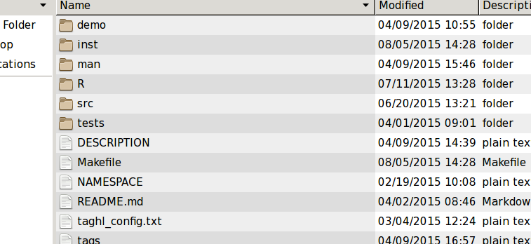
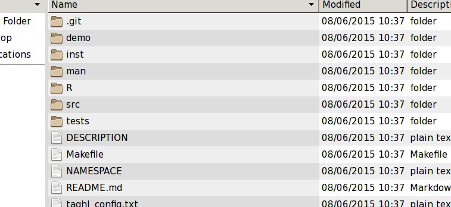
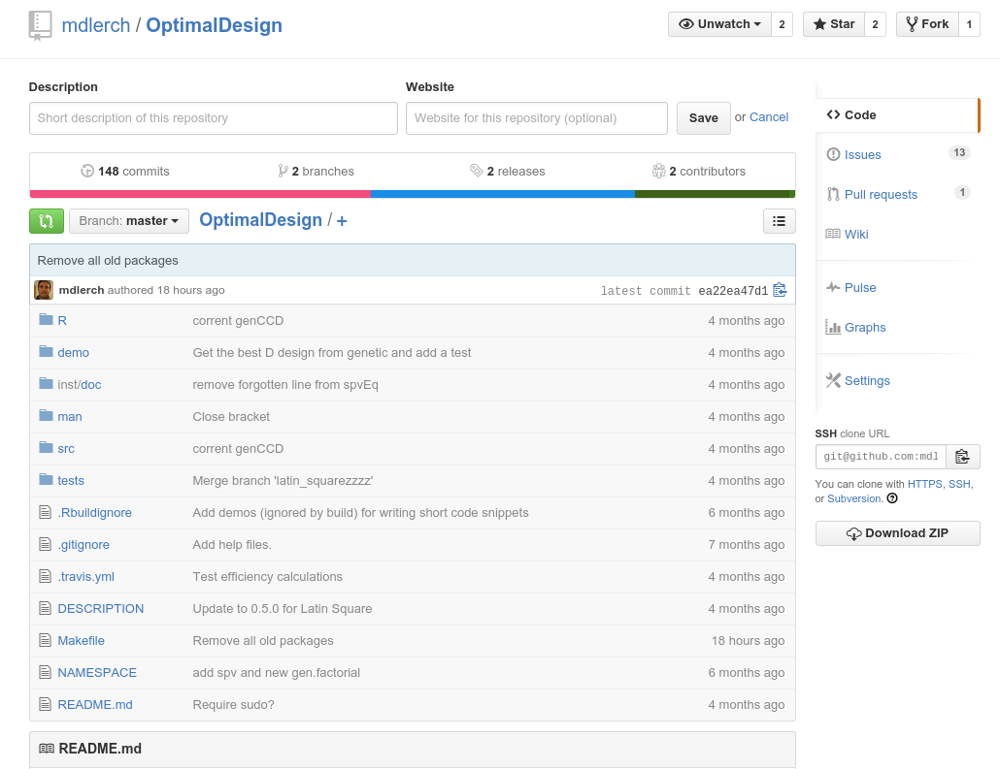
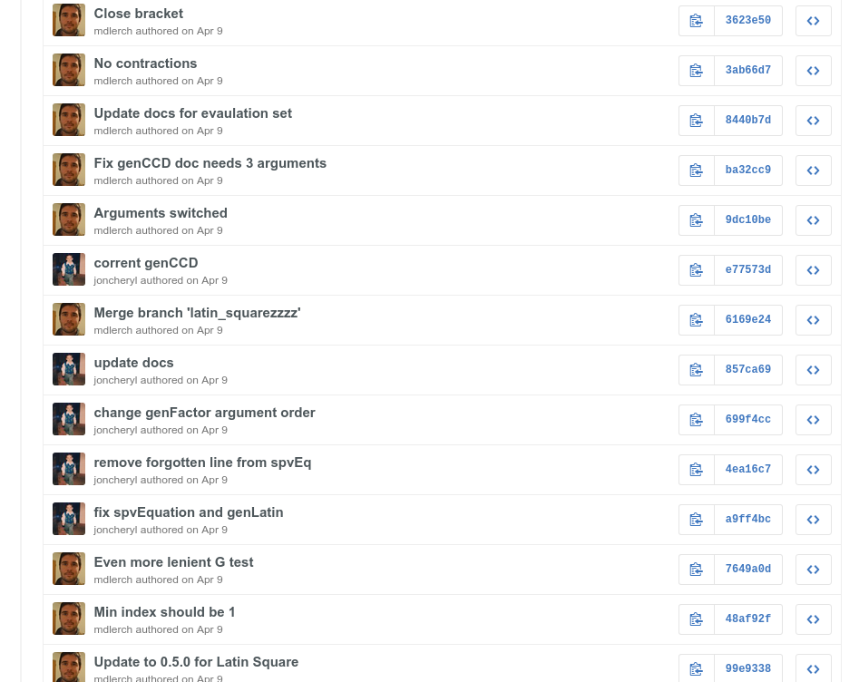
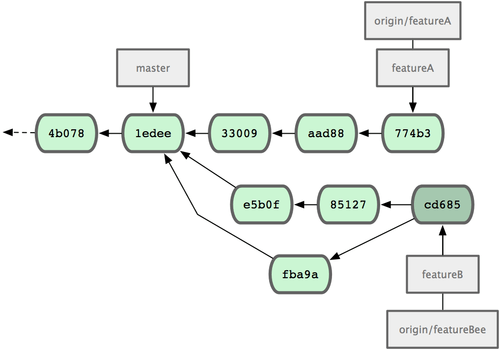
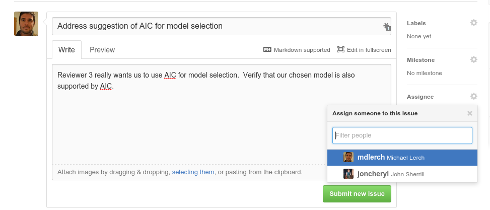
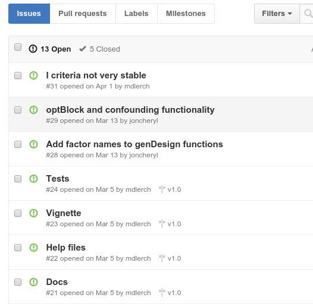

% Using git and online hosting for for efficient collaboration in scientific research
% Michael Lerch

Objectives and Goals
--------------------

Goals

- Many have heard about `git` and want to use it
- Differentiate between _github_, _bitbucket_, etc
- How does collaboration work with `git`
- What technical prowess does one need to use `git`

. . .

Non-goals

- Teach you to use `git`

`git` vs github
---------------

\begin{center}
\includegraphics[width=.3\textwidth]{./img/logo_git.png}
\end{center}

 . . .

- `git` is software you run on your computer
- Keep track of history of your project in the form of commits
- Connect to and integrate changes in other repositories

`git` vs github
---------------

\begin{center}
\includegraphics[width=.29\textwidth]{./img/logo_github.png}
\includegraphics[width=.29\textwidth]{./img/logo_bitbucket.png}
\includegraphics[width=.29\textwidth]{./img/logo_gitlab.png}
\end{center}

. . .

- github is a website / hosting provider
- host a repository at a centralized location
- incorporate collaborative tools
- one can use `git` without github
- github makes collaborating much easier

Differentiate hosting providers
-------------------------------

You can use all of these.  Simultaneously even.

- github

    - unlimited free _public_ repositories
    - _private_ repository pricing based on number of repositories
    - Built-in website hosting, probably most popular

. . .

- bitbucket

    - unlimited free _public_ repositories
    - unlimited free _private_ repositories (up to 5 collaborators)
    - _private_ repository pricing based on number of collaborators

. . .

- gitlab

    - unlimited free _public_repositories
    - unlimited free _private_ repositories
    - free self hosting options

An example
----------

- Project on which I work with one other person
- It should be simple enough to imagine how this workflow _easily_ scales to
  many more people
- It should be easy to see how aspects of this workflow appeal to a single
  contributer as well

My computer
-----------

Bad idea
--------

My computer
-----------

Add git
-------

Repositories
------------

>- I will work on my computer so I need a repository on my computer
>- A repository under my github account acts as the project home
>- John will work on his computer so he has a repository on his computer
>- A repository under John's github account allows me to integrate _John's_ work
  to the main repository under my github account.
>- _Trusted_ users can also be given _write_ access to the main repository

Github
------

Doing work?
-----------

. . .

- Write some more code, apply edits to a document, etc.

. . .

\centering
\includegraphics[width=.6\textwidth]{./img/saveas.png}

You have to _use_ `git`
-----------------------

- _commit_ my changes.
- _push_ my changes up to github
- John can now see and obtain my changes
- _pull_ commits from a remote repository into your local repository

Why is this better than dropbox or google drive?
------------------------------------------------

<!-- - Labelled history -->
<!-- - Collaborators update _when they want_ -->
<!-- - Collaborators release updates _when they want_ -->
<!-- - John and I work simultaneously without stepping on each other's toes -->

Branching
---------

\centering
\includegraphics[width=.6\textwidth]{./img/branch.png}

\tiny
https://www.atlassian.com/pt/git/tutorial/git-branches

Is `git` hard to use?
---------------------

- Do you know about files and folders?
- Do you have a different folder for each project?

. . .

\centering
`git` is easy!

Is `git` hard to use?
---------------------

\tiny
http://merrigrove.blogspot.com/2014/02/why-heck-is-git-so-hard-places-model-ok.html

Is `git` hard to use?
---------------------

- `git` is feature-filled and extremely powerful
- As a beginner it can be difficult to determine what is important
- A well-versed collaborator is invaluable

Collaborating on github
=======================

Reviewer Comments
-----------------

- "Please use track changes and save the document with your initials"
- "**Person A** and **Person B** are off the hook"
- "**Person C** and **Person D** please look at the comments for points I
  want you to work on"
- "Here's what I've done so far; I'm not finished but wanted to share what I
  have done so far"

Using Issues on github
----------------------

Using Issues on github
----------------------

- Your TODO list lives at the _same place_ as the project itself

Why aren't you using `git` already?
===================================

Classical Conditioning
----------------------

\begin{columns}
\column{.48\textwidth}

\begin{itemize}
    \item You are intimidated (don't be!)

    \item The reward (or punishment) is too far separated from the act!

    \item Must actively train one's self to use `git`
\end{itemize}

\column{.48\textwidth}

\includegraphics[width = \textwidth]{./img/pavlovdog1.png}

{\tiny http://truestorieswithgill.com/wp-content/uploads/2013/11/pavlovdog1.png }

\end{columns}

