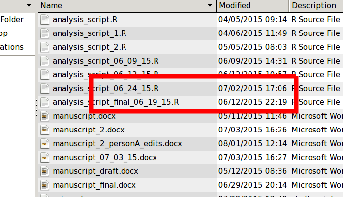

% Using git for for efficient collaboration in scientific research
% Michael Lerch

This is a talk about `git`.
---------------------------

Really, it's a talk about VCS (version control system).

`git` is one such VCS, arguably the most popular.  Some others that you may
heard about are `hg` and `svn`.

If this talk inspires you to start using VCS, use `git` unless you have a
specific reason to use `hg`.

What to expect
--------------

I am not actually going to teach you how to use `git`.

There are plenty of resources online.

More and more scientists do their work on a computer.  A lot of us have bad
habits.  We are going to investigate those bad habits and see how we might
correct them.

Why aren't you using git?
=========================

Classical learning
------------------

- The reward/punishment is too far temporally separated from the behavior
- Don't use git: have your computer freeze to recreate inefficiency
- Don't use git: receive a small electrical shot to recreate pain and
  frustration

What do your files look like on your computer?
==============================================

Why do we do this?
------------------

How does this even happen?
--------------------------

Heart is in the right place
---------------------------

- Sometimes we need to revert

- History is important

- Confusion for self

- Sharing is difficult, to say nothing of collaborating

First steps in `git`
--------------------

- A repository is a collection of _commits_

- _commits_ are snapshots of files

- Create a new commit after files change "enough"

- Entire history is available, but out of the way

Second steps in `git`
---------------------

- Use `diff` to see the difference between two snapshots.

- Use `tags` to mark important milestones

Sharing with others
===================

File organization
-----------------

- Our cleaner file organization makes collaboration much easier.

- Others can worry about file contents not which file is current.

Getting our files _out_
-----------------------

- Email?

- Dropbox?

Third steps in `git`
--------------------

- Create an online repository

- A copy of the repository that can be accessed by others.

- `push` your commits up to the central repository

- `pull` other people's commits down from the central repository

- Options: github, bitbucket, gitlab

- all offer additional _goodies_ in addition to hosting the repositories.

Getting something back
======================

Fourth steps in `git`
---------------------

- Use `branches` to _split_ (temporarily) from the main work.

- `merge` branches in when appropriate.

- Use `blame` to find out who is responsible for a particular line.

