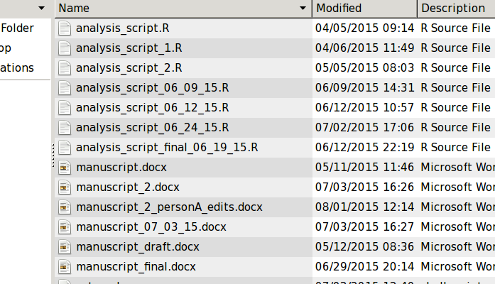

% Using git for for efficient collaboration in scientific research
% Michael Lerch

This is a talk about `git`.
---------------------------

\begin{columns}
\column{.48\textwidth}

\begin{itemize}
    \item Really, it's a talk about VCS (version control system).

    \item \texttt{git} arguably most popular.  Otherse include \texttt{svn} and \texttt{hg}.
\end{itemize}

\includegraphics[width = .8\textwidth]{./img/logo_git.png}

\column{.48\textwidth}
\includegraphics[width = .8\textwidth]{./img/logo_svn.png}

\includegraphics[width = .8\textwidth]{./img/logo_hg.png}
\end{columns}

What to expect
--------------

I am not actually going to teach you how to use `git`.

There are plenty of resources online.

More and more scientists do their work on a computer.  A lot of us have bad
habits.  We are going to investigate those bad habits and see how we might
correct them.

Why aren't you using git?
=========================

Classical learning
------------------

\begin{columns}
\column{.48\textwidth}

\begin{itemize}
    \item The reward (or punishment) is too far separated from the act!

    \item Must actively train one's self to use `git`
\end{itemize}

\column{.48\textwidth}

\includegraphics[width = \textwidth]{./img/pavlovdog1.png}

{\tiny http://truestorieswithgill.com/wp-content/uploads/2013/11/pavlovdog1.png }

\end{columns}

What do your files look like on your computer?
==============================================

Why do we do this?
------------------

How does this even happen?
--------------------------

Heart is in the right place
---------------------------

- Sometimes we need to revert

- History is important

- Confusion for self

- Sharing is difficult, to say nothing of collaborating

First steps in `git`
--------------------

- A repository is a collection of _commits_

- _commits_ are snapshots of files

- Create a new commit after files change "enough"

- Entire history is available, but out of the way

\begin{columns}
\column{.48\textwidth}
\includegraphics[width = \textwidth]{./img/files_git.png}
\column{.48\textwidth}
\includegraphics[width = \textwidth]{./img/history.png}
\end{columns}

Second steps in `git`
---------------------

- Use `diff` to see the difference between two snapshots.

\includegraphics[width = .7\textwidth]{./img/diff.png}

- Use `tags` to mark important milestones

Sharing with others
===================

Sharing
-------

- File organization

    - Our cleaner file organization makes collaboration much easier.

    - Others can worry about file contents not which file is current.

- Getting our files _out_

    - Email?

    - Dropbox?

Third steps in `git`
--------------------

- Create an online repository

- A copy of the repository that can be accessed by others.

- Options: github, bitbucket, gitlab

- all offer additional _goodies_ in addition to hosting the repositories.

\begin{columns}
\column{.48\textwidth}
\includegraphics[width = .9\textwidth]{./img/logo_github.png}
\column{.48\textwidth}
\includegraphics[width = .9\textwidth]{./img/logo_bitbucket.png}
\end{columns}

Getting something back (workflow)
=================================

Fourth steps in `git`
---------------------

- _push_ commits up; _pull_ commits down

\begin{center}
\includegraphics[width = 0.6\textwidth]{./img/history.png}
\end{center}

Fifth steps in `git`
--------------------

- _branching_ and _merging_

\begin{center}
\includegraphics[width = 0.8\textwidth]{./img/merge.png}

{\tiny https://git-scm.com/book/en/v2/Git-Branching-Basic-Branching-and-Merging}
\end{center}

`git` handles complicated work patterns
---------------------------------------

\begin{center}
\includegraphics[width = 0.8\textwidth]{./img/gitflow.png}
\end{center}

Summary
=======

Summary
-------

- History is available, but not in the way.

- Commits are discrete snapshots.  Making comparisons, reverting, seeing
  evolution of project is intrinsic rather than forced with timestamping files.

- github/bitbucket provide goodies.  _You_ control the files on your computer.

- Branches make collaborating efficient and non-destructive.

Make yourself use it!
=====================
